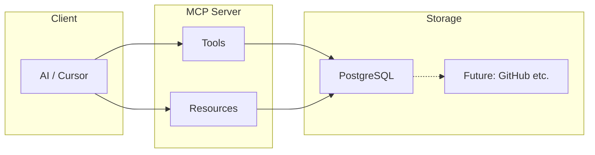

# Architecture

## High-level

- **Tools** — Actions: create/update task, milestone, release; update project; register doc; list/read docs.
- **Resources** — Read-only project state (e.g. `project://current/spec`, `project://current/tasks`, `project://current/plan`). The client can subscribe or poll these.
- **Storage** — PostgreSQL as the primary store. Later, adapters (e.g. GitHub Projects/Issues) can be added behind a store interface for sync or alternative backends.

## Project root

- **Enterprise** is the top-level hierarchy (ownership of projects and resources). One or more projects belong to an enterprise; the server may be scoped to one enterprise or one project per connection/config. See [00 — Definitions](00-definitions.md).
- **Project root** (optional): environment variable (e.g. `PROJECT_MCP_ROOT`) or process current working directory. Used for **doc_read** (resolving file paths in the repo) and for any file-based concerns. Project *data* (tasks, milestones, etc.) lives in PostgreSQL.

## Backend abstraction (future)

- Introduce a **Storage** or **ProjectStore** interface (e.g. `getProject()`, `getTasks()`, `saveTask()`, …).
- Primary implementation: **PostgreSQL** (e.g. `PostgresProjectStore` or EF Core DbContext).
- Later: `GitHubProjectStore` (and others) for sync or alternative backends without changing the MCP surface.

## Deployment

- **Containers** — MCP server and PostgreSQL run in Docker containers.
- **Orchestration** — .NET Aspire App Host composes and runs the containers, injects connection strings, and provides a single entry point. See [07 — Deployment](07-deployment.md).
