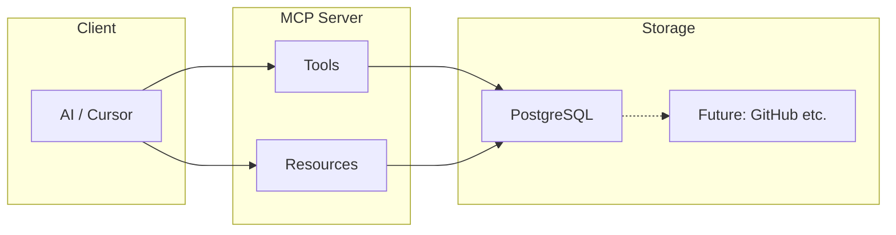
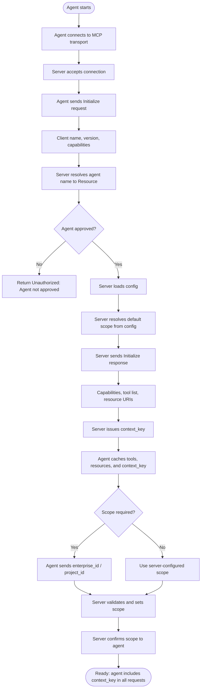

# Architecture

## High-level

- **Tools** — Actions: create/update task, milestone, release; update project; register doc; list/read docs.
- **Resources** — Read-only project state (e.g. `project://current/spec`, `project://current/tasks`, `project://current/plan`). The client can subscribe or poll these.
- **Storage** — PostgreSQL as the primary store. Later, adapters (e.g. GitHub Projects/Issues) can be added behind a store interface for sync or alternative backends.

**Note:** **Tasks are work items with level = Task**; task_* tooling is the task-level view of work_items.

## Web app (optional)

A **browser-based web app** (Blazor, .NET 10) can be hosted alongside the MCP server and PostgreSQL. It provides tree navigation, search, reports, Gantt charts, and issue tracking over the same data. **Users are authenticated with OAuth2** using **GitHub** as the provider; **their visibility into projects and enterprises is filtered by claims in their token** (e.g. allowed enterprise IDs and project IDs). All data access in the web app is scoped to those claims. See [14 — Project Web App](14-project-web-app.html).

A **mobile app** (Avalonia UI, phone form factor) uses **GitHub** as the same OAuth2 provider and allows users to **manage work items assigned to them** through a **task queue** (view, update status). It talks to the same API as the web app (no direct DB or MCP). See [15 — Mobile App](15-mobile-app.html).

## Initial handshake (agent and MCP)

When a new agent connects to the MCP server, they perform an initial handshake so the agent discovers the server’s capabilities and, if applicable, establishes scope. The following activity diagram describes that flow.

**Steps:**

1. **Connect** — The agent opens the transport to the MCP server (e.g. stdio pipe or HTTP/SSE). The server accepts the connection.
2. **Initialize request** — The agent sends the protocol **Initialize** request (client name, protocol version, client capabilities). The server receives it and loads its config (e.g. project root, default enterprise/project from env).
3. **Agent identity** — The server resolves the **client name** to a **Resource** in the enterprise. If the agent is not approved, return **Unauthorized. Agent not approved for Enterprise** and stop.
4. **Initialize response and context key** — The server responds with **Initialize** response: server capabilities, list of tools (names, parameters), and resource URI templates (e.g. `project://current/spec`, `project://current/tasks`, `project://current/plan`). The server **issues a context_key** (opaque token identifying this session) and includes it in the response. The agent **caches the context_key** along with the tools and resources. The server **instructs the agent** to include the context key in all subsequent requests.
5. **Scope (if required)** — If the MCP requires agent-supplied scope, the agent sends **scope_slug** (enterprise/project/work item slug). The server resolves the slug, **stores the scope for this session**, and confirms. The server **remembers this scope for that agent** (bound to the context_key) until the agent requests a different scope (e.g. by calling **scope_set** later). If scope is server-configured only, the flow takes “Use server-configured scope” and no scope message is sent.
6. **Ready** — With scope and context key established, the agent may call tools and read or subscribe to resources. **The agent must include the context_key in every request** (tool call and resource read/subscribe). The server validates the context key on each request, resolves the session and its scope, and rejects requests with a missing or invalid key. To switch context, the agent calls **scope_set** (with the same context_key).

## Project root

- **Enterprise** is the top-level hierarchy (ownership of projects and resources). One or more projects belong to an enterprise; the server may be scoped to one enterprise or one project per connection/config. See [00 — Definitions](00-definitions.html).
- **Project root** (optional): environment variable (e.g. `PROJECT_MCP_ROOT`) or process current working directory. Used for **doc_read** (resolving file paths in the repo) and for any file-based concerns. Project *data* (tasks, milestones, etc.) lives in PostgreSQL.

## Backend abstraction (future)

- Introduce a **Storage** or **ProjectStore** interface (e.g. `getProject()`, `getTasks()`, `saveTask()`, …).
- Primary implementation: **PostgreSQL** (e.g. `PostgresProjectStore` or EF Core DbContext).
- Later: `GitHubProjectStore` (and others) for sync or alternative backends without changing the MCP surface.

## Deployment

- **Containers** — MCP server and PostgreSQL run in Docker containers.
- **Orchestration** — .NET Aspire App Host composes and runs the containers, injects connection strings, and provides a single entry point. See [07 — Deployment](07-deployment.html).
