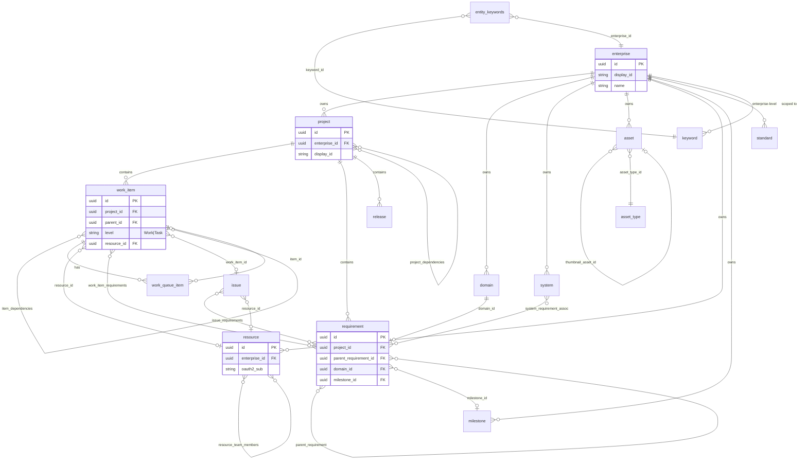

# Data Model

All entities are persisted in PostgreSQL. The same logical model can be mapped to external systems (e.g. GitHub Issues) for future integrations. **Methodology neutrality:** The data model does not assume or impose any specific methodology (agile or otherwise); it is methodology-agnostic.

**Hierarchy:** Enterprise (top-level ownership) → Project → work items (and tasks, same entity), milestones, releases, docs. See [00 — Definitions](00-definitions.html). The project methodology does not include sprints.

**Identifiers:** All entities follow the same pattern: an **immutable key (GUID)**, a **hierarchical slug**, and a **unique integer index** (the numeric part of the slug segment, per owner per type). See [08 — Identifiers](08-identifiers.html). For entities that may have parents of different types (e.g. work item/task under project or parent item; requirement under project or requirement), the parent is **identified by the parent’s slug** when building the child’s slug. When an entity’s slug changes, **all descendant slugs must be updated in the same transaction**; if the transaction fails, the entity’s slug change is rolled back (no partial updates).

**Keywords:** All entities have a collection of zero or more **keywords**. Keywords are stored in a separate table and scoped to a single enterprise. Entity–keyword relationships reference the keywords table with the **foreign key including the enterprise the entity belongs to**, so an entity can only be linked to keywords from its own enterprise.

## Data model diagram

The following diagram shows the main entities and their relationships. All entities include `id` (GUID) and `display_id` (slug); see [08 — Identifiers](08-identifiers.html). Optional or nullable FKs are shown as zero-or-one (`|o`) on the optional side.

## Enterprise

- **Role:** Top-level hierarchy representing ownership of projects and resources (see [00 — Definitions](00-definitions.html)).
- **Fields:** id, name, description (optional), createdAt, updatedAt. Extensible for tenant/billing metadata later.
- **Creation rule:** **Enterprise records can only be added by a user with the SUDO role.** The API and web app must enforce this; users without SUDO cannot create enterprises (they may still view and manage enterprises/projects for which they have scope claims).
- Projects belong to one enterprise via `enterprise_id`. Enterprises may have **standards** assigned to them (enterprise-level standards); see Standards below.

## Project

- **Metadata:** name, description, status (`active` | `on-hold` | `archived`), createdAt, updatedAt. **enterpriseId** — owning enterprise.
- **Tech stack:** key-value mapping (e.g. `languages: ["TypeScript"]`, `frameworks: ["Node"]`). Values are string arrays.
- **Docs:** list of doc entries. Each entry: name, path (relative to project root), type (`readme` | `adr` | `spec` | `other`), optional description. Content lives in repo files; the project only stores references. Projects may have **standards** assigned to them (project-level standards); see Standards below.
- **Project-to-project dependencies** — Tracked with a **one-to-many relationship from the (dependent) sub-project to zero or more parent projects**. The dependent project holds the references to the projects it depends on (its parents). A project can have zero, one, or many parent projects; parents are stored on the dependent side (e.g. a join table `project_dependencies`: `dependent_project_id`, `parent_project_id`).

## Domain

- **Ownership:** Domains **belong to an enterprise**. Each domain has a **unique name within that enterprise**. The domain's slug is **enterprise slug** + hyphen + **name** (e.g. `E1-security`, `E1-billing`). See [08 — Identifiers](08-identifiers.html).
- **Role:** A domain groups requirements (and the work that implements them) by a coherent area of concern. A requirement can belong to **at most one domain** or to **no domain**; stored as `domain_id` (FK, nullable) on the requirement.
- **Fields:** id (GUID), display_id (slug), enterprise_id (FK), name (unique per enterprise), description (optional). Stored in a **domains** table.

## System

- **Ownership:** Systems **belong to exactly one enterprise**. Each system has a **unique name within that enterprise**. The system's slug is **enterprise slug** + hyphen + **name** (same as Domain; e.g. `E1-payment-api`, `E1-auth-framework`). See [08 — Identifiers](08-identifiers.html).
- **Role:** A system is a collection of one or more related requirements. A requirement may be associated with a system **as included in the system** (part of the system) **or as a dependency of the system** (the system depends on that requirement). Stored in **system_requirement_associations** (system_id, requirement_id, role: `included` | `dependency`); unique (system_id, requirement_id) per association.
- **Category:** Systems can be categorized as **Application**, **Framework**, **API**, or **Compound** (unions of the other categories). Stored as **category** (enum) on the system.
- **Fields:** id (GUID), display_id (slug), enterprise_id (FK), name (unique per enterprise), description (optional), **category** (enum: Application, Framework, API, Compound). Stored in a **systems** table.

## Asset

- **Ownership:** Assets are **linked directly to an enterprise** and have a **unique name within that enterprise**. The asset's slug is **enterprise slug** + hyphen + **name** (same as Domain and System; e.g. `E1-architecture-diagram`). See [08 — Identifiers](08-identifiers.html). **Links to assets use the immutable identifier (GUID)**, not the slug.
- **Asset type:** Each asset has an **asset type** from a **lookup table** (`asset_types`). Asset type has a **default icon** specified by a URN (`default_icon_urn`).
- **URN and thumbnail:** Each asset has a **URN** to a file or online resource. An asset may **link to a thumbnail** (`thumbnail_asset_id` FK to assets, nullable); the thumbnail asset's URN is used for display. **If the asset has a thumbnail defined, the URN to the thumbnail overrides the default icon**; otherwise the asset type's default icon URN is used.
- **Fields:** id (GUID), display_id (slug), enterprise_id (FK), name (unique per enterprise), **asset_type_id** (FK to asset_types), **urn**, **thumbnail_asset_id** (FK to assets, nullable), description (optional). Stored in an **assets** table. **asset_types** lookup: id, code (or name), **default_icon_urn** (URN for default icon).

## Resource

- **Ownership:** Resources are **directly tied to one enterprise** and have a **unique name within that enterprise**. The resource's slug is **enterprise slug** + hyphen + **name** (same as Asset, Domain, System; e.g. `E1-backend-team`, `E1-jane-doe`). See [08 — Identifiers](08-identifiers.html). **Links to resources use the immutable identifier (GUID)**, not the slug.
- **OAuth2 identity:** A resource can have an **OAuth2 id** (e.g. **GitHub user id**, the stable identifier from GitHub as the OAuth2 provider, used by the [web app](14-project-web-app.html) and [mobile app](15-mobile-app.html)) stored in **oauth2_sub** (or equivalent). When present, the backend can resolve the authenticated user (GitHub user id from the token or GitHub API) to this resource so that “assigned to me,” task queue, and visibility are tied to the correct resource. Typically only **person** resources (not teams) have an OAuth2 id; teams are resolved via **resource_team_members** (user’s resource is a member of the team). The OAuth2 id is **unique per provider** (GitHub user id is unique within GitHub).
- **Teams:** A resource **can be a team of other resources**. Stored in **resource_team_members** (team_id FK to resources, member_id FK to resources); unique (team_id, member_id). Work items (and tasks) can be assigned to a team (the team is a resource) or to an individual resource.
- **Assignment:** Work items (and tasks, same table) and issues reference the assigned resource by **resource_id** (FK to resources, nullable). When a work item (level = Work) is assigned to a resource (including a team), that assignment applies to its child items per assignment rules.
- **Fields:** id (GUID), display_id (slug), enterprise_id (FK), name (unique per enterprise), description (optional), **oauth2_sub** (nullable; OAuth2 subject id, e.g. GitHub user id, linking this resource to an authenticated user). Stored in a **resources** table. **resource_team_members** — team_id (FK to resources), member_id (FK to resources). Unique (team_id, member_id).

## Requirements

- **Parent–child relation** — One parent requirement has zero or more child requirements (sub-requirements). Stored as `parent_requirement_id` (FK, nullable) on the child; a requirement with no parent is top-level under the project. The parent is the “one” side, children are the “many” side.
- **Domain** — A requirement can belong to **at most one domain** or to **no domain**. Stored as `domain_id` (FK to domains, nullable) on the requirement.
- **System** — A requirement may be associated with zero or more systems. Each association is either **included in** the system (requirement is part of the system) or **dependency of** the system (the system depends on that requirement). Stored in **system_requirement_associations** (system_id, requirement_id, role).
- **Fields** — id (GUID), display_id (slug), parent_requirement_id (FK, nullable), project_id (FK), domain_id (FK, nullable), milestone_id (FK, nullable), **title** (or name), **description** (text, nullable), **acceptance_criteria** (text or JSONB, nullable; conditions that must be met for the requirement to be satisfied), **approved_by** (FK to resources, nullable; the resource who approved the requirement), **approved_on** (timestamp, nullable; when the requirement was approved). Stored in **requirements** table.

## Standards

- **Assignment:** Standards are assigned to either an **Enterprise** or a **Project** (not both). Enterprise-level standards apply across the enterprise; project-level standards apply to that project (and optionally its sub-projects).
- **Identifiers:** GUID (immutable) and slug with the same hierarchy rules as requirements; slug is derived from the owning enterprise or project (e.g. `E1-STD0001`, `E1-P001-STD0001`). Requirements and standards each use a sequentially allocated unique index for their slug segment under a given owner — no two requirements under the same owner share the same segment, and no two standards under the same owner share the same segment. See [08 — Identifiers](08-identifiers.html).
- **Fields:** id (GUID), display_id (slug), enterprise_id (FK, nullable) or project_id (FK, nullable) — exactly one set — **title** (or name), **description** (text, nullable), **detailed_notes** (text or JSONB, nullable; full standard content, rules, or references). Stored in **standards** table.

## Work (work items)

- **Role:** Work and work item are the same concept (see [00 — Definitions](00-definitions.html)). A single entity **work_items** holds all items: top-level under a **project** or children under another item. Each row has **level** = **`Work`** or **`Task`**. **Level = Work** items can have **deadline**, **start date**, **effort in hours**, **complexity** (1–5), **priority** (1–5), **states** (same as milestones: Planning, Implementation, Deployment, Validation, Approval, Complete), **task_ordering** (`ordered` | `parallel`), and a **work queue**. **Level = Task** items have **status** (`todo` | `in-progress` | `done` | `cancelled`). **Both levels** may have **item_dependencies** (work–work, work item–work item, task–task, or mixed). **Both levels** can link to **requirements** via **work_item_requirements**. Assigning an issue to an item may expand that item’s requirement set (see Issues). Within a work item (level = Work), child items may be ordered or parallel; when ordered, each child has **sequence_in_parent**.
- **Structure:** Items have **project_id** (FK; for top-level items, **parent_id** null) or **parent_id** (FK to work_items; for children). No separate work table. **Item-to-item dependencies:** **item_dependencies** (dependent_item_id, prerequisite_item_id), both FKs to work_items. Applies to any items (level = Work or Task), so work–work, work item–work item, and task–task dependencies are all supported. **Time budget per resource:** Expected and actual effort per resource are stored in **work_item_resource_effort** (work_item_id, resource_id, **resource_effort_expected**, **resource_effort_actual**); unique (work_item_id, resource_id). Enables multiple resources per item with separate expected/actual hours. See [08 — Identifiers](08-identifiers.html).
- **Fields (work_items table):** id (GUID), display_id (slug), **project_id** (FK), **parent_id** (FK to work_items, nullable), **level** (`Work` | `Task`), **state** (enum; used when level = Work and for milestone progression), **status** (nullable; when level = Task: `todo` | `in-progress` | `done` | `cancelled`), **task_ordering** (nullable; when level = Work), **sequence_in_parent** (nullable), **resource_id** (FK to resources, nullable; when set on level = Work, all children inherit per rule), **deadline**, **start_date**, **effort_hours**, **complexity**, **priority** (nullable; used when level = Work), title, description, labels (array/JSONB), milestone_id, release_id, created_at, updated_at. Each row with level = Work has a **work queue** (see below). **Milestone progression (level = Task):** For evaluating whether a milestone can advance, Task-level items are mapped to the six-state model: **status = done** → Complete; **in-progress** → Implementation; **todo** → Planning; **cancelled** → not Complete (excluded from “all work achieved that state”).

## Work queue

- **Role:** Each item with **level = Work** has a **work queue** — an ordered list of **items** (level = Task or child work items) in the order they are to be completed. See [00 — Definitions](00-definitions.html) (Work (work item)).
- **Queue items:** Each entry is one or more **items** at the same **queue depth**. Items at equal queue depth are **grouped as a single work queue item**. Stored as **work_queue_items**: work_item_id (FK to work_items, the queue owner; must be level = Work), position (int), item_id (FK to work_items). For a group at the same depth: multiple rows with the same work_item_id and position, each with a different item_id.
- **Filtering by resource:** Work queues can be **filtered by resource** (e.g. show only queue items where the item involves a given resource/assignee). Filtering is applied when querying or presenting the queue; the underlying queue order and grouping are unchanged.

## Assignment and blocking

- **Work item assignment inheritance:** If an item (level = Work) is assigned to one or more resources, **all items (tasks and sub-work)** under it are also assigned to that resource (by rule or by cascading). Assignment is stored as **resource_id** (FK to resources) on the item and applied to its children (same table) when present.
- **Unassign and reassign:** Items can be **unassigned** or **reassigned** to a different resource at any time. Reassigning a work item may cascade to its child items; individual items can still be overridden or unassigned.
- **Blocking:** **Unassigned items that have dependent items become blockers** to those dependents. A prerequisite that is unassigned blocks progress on any item that depends on it (e.g. via item_dependencies). This applies **even if the dependent items are assigned** — the dependent remains blocked until the prerequisite is assigned (and completed, per dependency rules) or the dependency is removed. Blocking is derived from: (1) dependency relationship (item_dependencies; applies to any item), and (2) prerequisite is unassigned.

- **Issues:** An **issue** is a defect in planning or implementation associated with one or more requirements (see [00 — Definitions](00-definitions.html)). **State** enum: **Open** | **InProgress** | **Done** | **Closed**. **Severity** and **priority** (enum or scale, nullable) for triage and ordering. **Link to work item and assignment:** If the issue is associated with **open work** on one or more of its requirements, the issue is **linked to that work item** (issue.work_item_id) and **assigned to the resource** assigned to that work item (assignment inherited from the item). Otherwise, the issue is **freely associated with the requirement(s)** only (no work_item_id) until a work item is created and the issue is assigned to it. **Expanding requirements:** Assigning an issue to a work item **may expand the set of requirements** associated with that work item (the work item’s scope gains the issue’s requirement associations). Stored as: **issues** (id, display_id, work_item_id FK nullable, resource_id nullable, title, description, **state** (enum: Open | InProgress | Done | Closed), **severity**, **priority**, …); **issue_requirements** (issue_id, requirement_id) for the one-to-many issue–requirement link. Work item may have a derived or stored set of requirement associations that grows when issues are assigned to it.

- **Milestones:** A **milestone** is a collection of requirements within an enterprise that spans zero or more projects and that are to be completed (see [00 — Definitions](00-definitions.html)). Id, title, dueDate (nullable), **state** (enum: Planning, Implementation, Deployment, Validation, Approval, Complete), description. Milestones belong to an enterprise (enterprise_id). **Total scope** is defined by **project_id** (FK to project, nullable; when set, scope includes that project and its sub-projects) and **milestone_scope_milestones** (milestone_id, scope_milestone_id) — the milestone's total scope includes those other milestones. **The relationship between a milestone and a project** can thus be explicit (project_id) or inferred through requirements: requirements link to a milestone (requirement.milestone_id) and belong to a project (requirement.project_id); the set of projects “in” a milestone is therefore derived from the projects of the requirements that reference that milestone. **Reporting scope:** A milestone may be **scoped to a single project and its sub-projects** for reporting; that scope **filters the requirements** associated with the milestone (only requirements in that project or its sub-projects that are linked to the milestone are included). **State progression:** A milestone may move to the next state only when **all work associated with the requirements for that milestone** (within the scope, when scoped) **has achieved that next state**. Work items use the same state enum; work and tasks may use it or a mapping so that milestone progression can be evaluated.
- **Releases:** id, name, tagVersion, date (nullable), notes.

## Keywords

- **Scope** — Keywords are stored in a separate table and scoped to a single enterprise. Each keyword row belongs to one enterprise (e.g. `enterprise_id` FK).
- **Entity relationship** — Every entity type (enterprise, project, requirement, standard, work, work_item, task, milestone, release, doc, asset, resource, domain, system, issue, etc.) can have zero or more keywords. The relationship table includes the **enterprise the entity belongs to** in the foreign key so that: (1) the entity’s enterprise is stored on the link row, and (2) the keyword’s enterprise must match, ensuring entities only reference keywords from their enterprise.
- **Tables** — `keywords` (id, enterprise_id, label); `entity_keywords` (enterprise_id, entity_type, entity_id, keyword_id) with unique (entity_type, entity_id, keyword_id) and FKs such that keyword.enterprise_id = entity_keywords.enterprise_id.

## Change tracking

- **Requirement:** **Change tracking must be enabled on all fields of all entities** in the database. Every insert, update, and delete to entity data must be recorded so that what changed, when, and (where available) by whom can be determined.
- **Scope:** Applies to all entity tables (enterprise, project, milestone, release, work_item, requirement, resource, domain, system, asset, issue, standards, keywords, docs, and junction tables such as project_dependencies, item_dependencies, work_item_resource_effort, milestone_scope_milestones, entity_keywords, etc.). **All columns** of these tables are in scope; no field may be excluded from change tracking.
- **Context to record:** Each change record must include, when available:
  - **Session identifier** — The session that made the change (e.g. MCP `context_key`, or web/API session id). Enables correlating changes to a specific connection or login session.
  - **Resource identifier** — The resource (person, team, or agent) who made the change (e.g. `resource_id` FK to resources, resolved from the authenticated user or agent). Enables “who did this” and audit by actor.
  - **Correlation id** — The correlation id of the request, if the client sent one (e.g. `X-Correlation-Id` or `MCP-Correlation-Id`). Enables grouping all changes that are part of the same logical request or user action.
  - **Changed_at** (and optionally old/new value or full row state) as before.
- **Implementation options:** Implement via one or more of: (1) **audit/history tables** (e.g. per entity or a generic audit table with entity_type, entity_id, field_name, old_value, new_value, **session_id**, **resource_id** (FK nullable), **correlation_id**, changed_at), (2) **database triggers** that write to audit tables on INSERT/UPDATE/DELETE (session/resource/correlation_id must be supplied by the application, e.g. via session variables or a context table), (3) **application-level** writes to an audit log before or after persistence, passing session identifier, resource identifier, and correlation id from the request context, or (4) **system-versioned / temporal tables** plus application-managed context columns where supported. The chosen mechanism must record the previous and new value (or full row state) for every modified field and must include **session identifier**, **resource identifier**, and **correlation id** (nullable when not provided) on every change record.
- **Retention and access:** Retention policy and access to change history are operational concerns (e.g. how long to keep audit rows, who can query them). The schema and application must support recording; query APIs for audit history can be added later.

## PostgreSQL persistence

- **Database** — PostgreSQL. Connection via configuration (e.g. env `DATABASE_URL` or `PROJECT_MCP_CONNECTION_STRING`).
- **Tables** (or equivalent schema). Change tracking (see above) must be enabled for all entity tables and all fields. Each entity has `id` (GUID, PK) and `display_id` (slug, unique); see [08 — Identifiers](08-identifiers.html). For entities with polymorphic parents, the child’s slug is derived from the **parent’s slug**; slug changes and all descendant slug updates must run in a **single transaction** (roll back entire change on failure).
  - **enterprise** — id (GUID), display_id (slug, e.g. E1), name, description, created_at, updated_at. Top-level ownership (see [00 — Definitions](00-definitions.html)).
  - **domains** — id (GUID), display_id (slug, e.g. E1-security, E1-billing), enterprise_id (FK), name (unique per enterprise), description (optional). Domain slug = enterprise slug + hyphen + name. See [08 — Identifiers](08-identifiers.html).
  - **systems** — id (GUID), display_id (slug, e.g. E1-payment-api, E1-auth-framework), enterprise_id (FK), name (unique per enterprise), description (optional), **category** (enum: Application, Framework, API, Compound). System slug = enterprise slug + hyphen + name; same as Domain. See [08 — Identifiers](08-identifiers.html).
  - **asset_types** — id (GUID or code), code (e.g. document, image, video), **default_icon_urn** (URN for default icon). Lookup table for asset types.
  - **assets** — id (GUID), display_id (slug, e.g. E1-architecture-diagram), enterprise_id (FK), name (unique per enterprise), **asset_type_id** (FK to asset_types), **urn** (to file or online resource), **thumbnail_asset_id** (FK to assets, nullable; when set, this asset's thumbnail is that asset's URN; overrides default icon for display), description (optional). Asset slug = enterprise slug + hyphen + name. Links to assets use id (GUID). See [08 — Identifiers](08-identifiers.html).
  - **resources** — id (GUID), display_id (slug, e.g. E1-backend-team, E1-jane-doe), enterprise_id (FK), name (unique per enterprise), description (optional), **oauth2_sub** (nullable; OAuth2 subject id, e.g. GitHub user id, so the backend can resolve the authenticated user to this resource). Resource slug = enterprise slug + hyphen + name; same as Asset. Links to resources use id (GUID). A resource can be a team (see resource_team_members). See [08 — Identifiers](08-identifiers.html).
  - **resource_team_members** — team_id (FK to resources), member_id (FK to resources). Unique (team_id, member_id). A resource that is a team has one or more member resources.
  - **project** — id (GUID), display_id (slug, e.g. E1-P001), enterprise_id (FK), metadata (name, description, status, createdAt, updatedAt), tech stack (JSONB or related table), and doc list (JSONB or **docs** table).
  - **project_dependencies** — dependent_project_id (FK to project), parent_project_id (FK to project). Unique (dependent_project_id, parent_project_id). One-to-many from dependent project to zero or more parent projects; the dependent project is the “one” side, the parent projects are the “many” side.
  - **work_items** — Single table for work and tasks (Work and work item are the same concept). id (GUID), display_id (slug; see [08 — Identifiers](08-identifiers.html)), **project_id** (FK), **parent_id** (FK to work_items, nullable; when null, top-level under project; when set, sub-work or sub-task under that parent), **level** (`Work` | `Task`), **state** (enum: Planning, Implementation, Deployment, Validation, Approval, Complete; used when level = Work and for milestone progression), **status** (nullable; when level = Task: `todo` | `in-progress` | `done` | `cancelled`), **task_ordering** (nullable; when level = Work: `ordered` | `parallel`), **sequence_in_parent** (nullable int), **resource_id** (FK to resources, nullable; when set on level = Work, all child items inherit per rule), **deadline**, **start_date**, **effort_hours**, **complexity**, **priority** (nullable; planning attributes for level = Work), title, description, labels (array/JSONB), milestone_id, release_id, created_at, updated_at. Each row with level = Work has a work queue (work_queue_items). Both levels can link to requirements via work_item_requirements. Can be unassigned or reassigned.
  - **work_queue_items** — work_item_id (FK to work_items; queue owner, must be level = Work), position (int), item_id (FK to work_items). Items at the same (work_item_id, position) form a single queue item (group). Unique (work_item_id, position, item_id).
  - **item_dependencies** — dependent_item_id (FK to work_items), prerequisite_item_id (FK to work_items). Unique (dependent_item_id, prerequisite_item_id). Any item (level = Work or Task) can depend on zero or more other items; supports work–work, work item–work item, and task–task dependencies. The dependent is the “one” side, the prerequisites are the “many” side.
  - **work_item_resource_effort** — work_item_id (FK to work_items), resource_id (FK to resources), **resource_effort_expected** (e.g. hours, decimal; nullable), **resource_effort_actual** (e.g. hours, decimal; nullable). Unique (work_item_id, resource_id). Time budget per resource: expected and actual effort per (item, resource) pair.
  - **milestones** — id (GUID), display_id (slug), enterprise_id (FK), **project_id** (FK to project, nullable; when set, scope includes that project and its sub-projects), title, due_date, **state** (enum: Planning, Implementation, Deployment, Validation, Approval, Complete), description. Total scope is defined by project_id plus **milestone_scope_milestones**. Milestone may advance to next state only when all work associated with its requirements (within scope) has achieved that state.
  - **milestone_scope_milestones** — milestone_id (FK to milestones), scope_milestone_id (FK to milestones). Unique (milestone_id, scope_milestone_id). The milestone’s total scope includes these other milestones (and their requirements). Together with milestone.project_id, defines the full scope for reporting and state progression.
  - **releases** — id (GUID), display_id (slug), project_id (FK), name, tag_version, date, notes.
  - **docs** (or embedded in project) — id (GUID), display_id (slug), project_id (FK), name, path, type, description.
  - **requirements** — id (GUID), display_id (slug, e.g. E1-P001-REQ0001 or E1-P001-REQ0001-REQ0002 for child), parent_requirement_id (FK, nullable; one parent to zero or more children), project_id (FK), domain_id (FK to domains, nullable; at most one domain per requirement; null if none), milestone_id (FK, nullable; when set, this requirement is part of that milestone’s collection), **title** (or name), **description** (text, nullable), **acceptance_criteria** (text or JSONB, nullable), **approved_by** (FK to resources, nullable), **approved_on** (timestamp, nullable). Slug segment (REQ + number) is sequentially unique per owner.
  - **issues** — id (GUID), display_id (slug), work_item_id (FK, nullable), **resource_id** (FK to resources, nullable), title, description, **state** (enum: **Open** | **InProgress** | **Done** | **Closed**), **severity** (enum, nullable), **priority** (enum or number, nullable), and issue-specific fields. Issue is associated with one or more requirements via issue_requirements.
  - **issue_requirements** — issue_id (FK), requirement_id (FK). Unique (issue_id, requirement_id). An issue is associated with one or more requirements. Assigning an issue to a work item may expand the work item’s set of requirements (work item gains these requirement associations; store via work_item_requirements if needed).
  - **work_item_requirements** — work_item_id (FK to work_items), requirement_id (FK). Unique (work_item_id, requirement_id). Requirements associated with an item (level = Work or Task); expanded when an issue (with its issue_requirements) is assigned to the item.
  - **system_requirement_associations** — system_id (FK to systems), requirement_id (FK to requirements), **role** (`included` | `dependency`). Unique (system_id, requirement_id). A requirement is either **included in** the system or a **dependency of** the system per row.
  - **standards** — id (GUID), display_id (slug, e.g. E1-STD0001 or E1-P001-STD0001), enterprise_id (FK, nullable), project_id (FK, nullable) — exactly one of enterprise_id or project_id set. **title** (or name), **description** (text, nullable), **detailed_notes** (text or JSONB, nullable). Slug segment (STD + number) is sequentially unique per owner. See [08 — Identifiers](08-identifiers.html).
  - **keywords** — id (GUID), enterprise_id (FK), label (text). Scoped to a single enterprise; unique (enterprise_id, label) per enterprise.
  - **entity_keywords** — enterprise_id (FK; the enterprise the entity belongs to), entity_type (e.g. project, requirement, standard, work_item, domain, system, asset, resource, …), entity_id (GUID of the entity), keyword_id (FK to keywords). Unique (entity_type, entity_id, keyword_id). Enforce that keyword.enterprise_id = entity_keywords.enterprise_id so entities only link to keywords from their enterprise.

- **Doc content** — Not stored in the database; only paths and metadata. Actual content lives in the repo. **doc_read** reads from the filesystem relative to project root.
