# MCP Endpoint Diagrams

For each MCP endpoint (tools and resources), this document provides:

1. **Activity diagram** — Logic and decision flow for the endpoint.
2. **Sequence diagram** — Interactions between the **Agent**, **MCP Server** (session/scope validation, tool or resource handler), and **Storage** (PostgreSQL or file system where applicable).

All endpoints assume the agent has completed the [initial handshake](02-architecture.html#initial-handshake-agent-and-mcp), **agent identity has been approved**, and the agent sends a valid **context_key** on every request. The server validates the context key and resolves the session scope before executing any tool or resource read.

**Note:** **Tasks are work items with level = Task**; task_* endpoints are the task-level view of work_items.

---

## Scope

### scope_set

**Activity diagram**

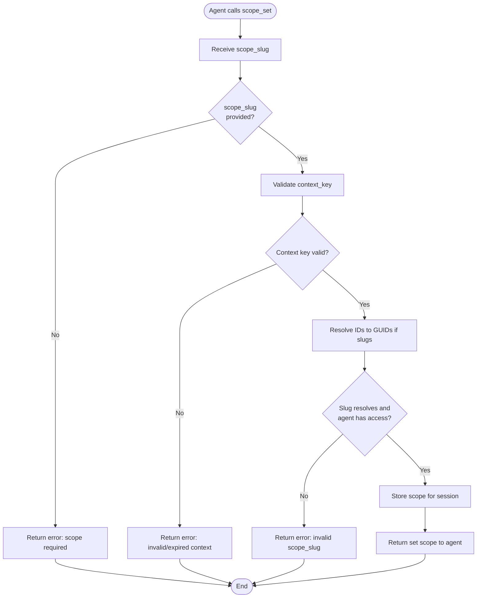
```mermaid
flowchart TB
  Start([Agent calls scope_set]) --> Params[Receive scope_slug]
  Params --> AnyParam{scope_slug\nprovided?}
  AnyParam -->|No| ErrParams[Return error: scope required]
  AnyParam -->|Yes| ValidateContext[Validate context_key]
  ValidateContext --> ContextOk{Context key valid?}
  ContextOk -->|No| ErrContext[Return error: invalid/expired context]
  ContextOk -->|Yes| ResolveIds[Resolve IDs to GUIDs if slugs]
  ResolveIds --> IdsOk{Slug resolves and\nagent has access?}
  IdsOk -->|No| ErrIds[Return error: invalid scope_slug]
  IdsOk -->|Yes| StoreScope[Store scope for session]
  StoreScope --> ReturnScope[Return set scope to agent]
  ReturnScope --> End([End])
  ErrParams --> End
  ErrContext --> End
  ErrIds --> End
```

**Sequence diagram**

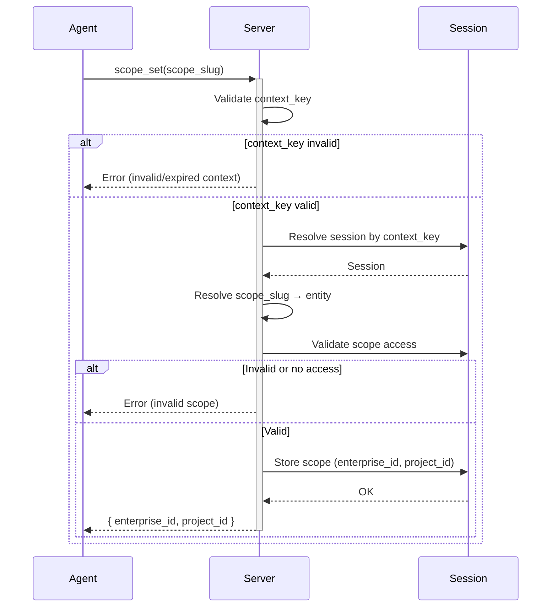
```mermaid
sequenceDiagram
  participant Agent
  participant Server
  participant Session

  Agent->>+Server: scope_set(scope_slug)
  Server->>Server: Validate context_key
  alt context_key invalid
    Server-->>Agent: Error (invalid/expired context)
  else context_key valid
    Server->>Session: Resolve session by context_key
    Session-->>Server: Session
    Server->>Server: Resolve scope_slug → entity
    Server->>Session: Validate scope access
    alt Invalid or no access
      Server-->>Agent: Error (invalid scope)
    else Valid
      Server->>Session: Store scope (enterprise_id, project_id)
      Session-->>Server: OK
      Server-->>-Agent: { enterprise_id, project_id }
    end
  end
```

---

### scope_get

**Activity diagram**

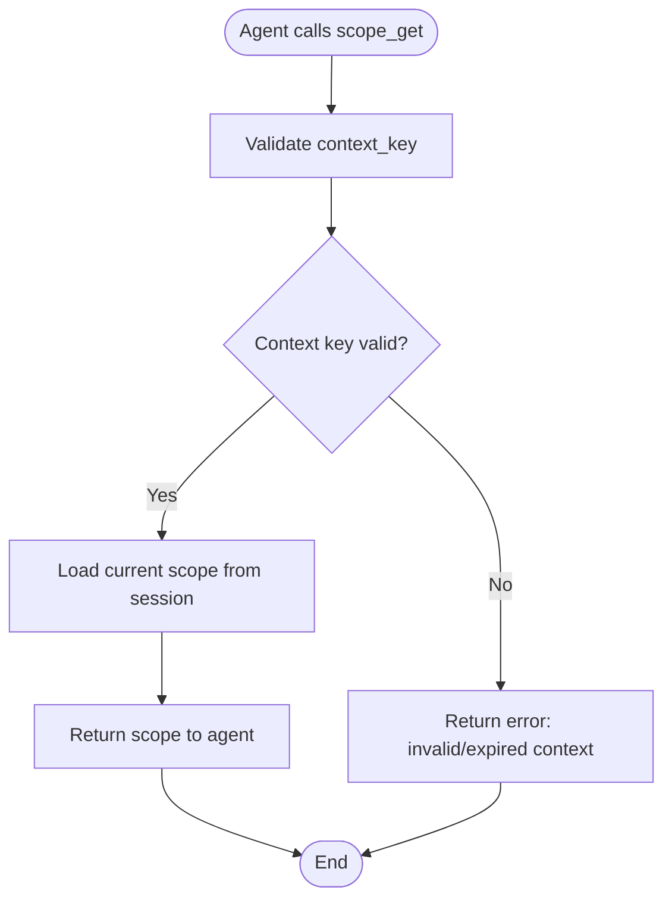
```mermaid
flowchart TB
  Start([Agent calls scope_get]) --> ValidateContext[Validate context_key]
  ValidateContext --> ContextOk{Context key valid?}
  ContextOk -->|No| ErrContext[Return error: invalid/expired context]
  ContextOk -->|Yes| LoadScope[Load current scope from session]
  LoadScope --> ReturnScope[Return scope to agent]
  ReturnScope --> End([End])
  ErrContext --> End
```

**Sequence diagram**

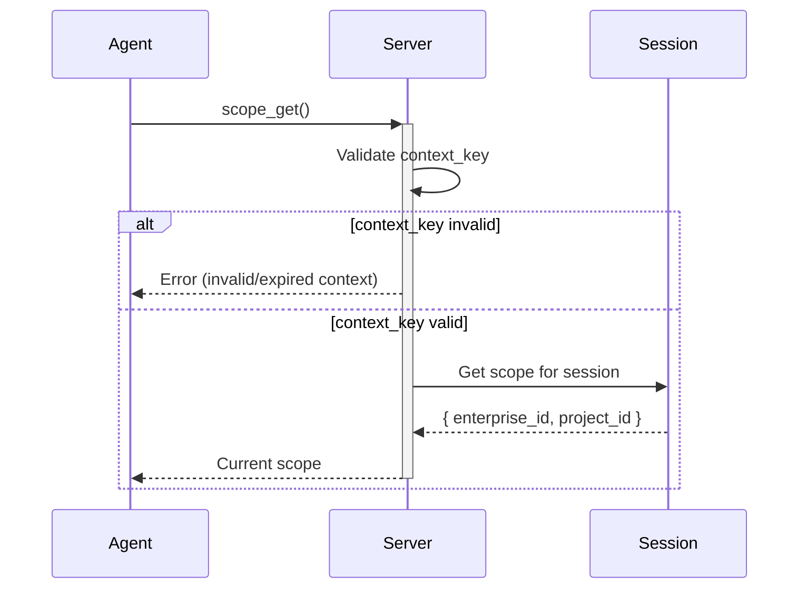
```mermaid
sequenceDiagram
  participant Agent
  participant Server
  participant Session

  Agent->>+Server: scope_get()
  Server->>Server: Validate context_key
  alt context_key invalid
    Server-->>Agent: Error (invalid/expired context)
  else context_key valid
    Server->>Session: Get scope for session
    Session-->>Server: { enterprise_id, project_id }
    Server-->>-Agent: Current scope
  end
```

---

## Project

### project_get_info

**Activity diagram**

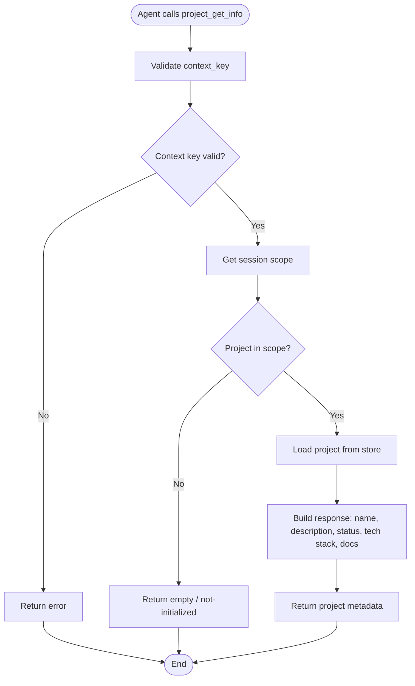
```mermaid
flowchart TB
  Start([Agent calls project_get_info]) --> ValidateContext[Validate context_key]
  ValidateContext --> ContextOk{Context key valid?}
  ContextOk -->|No| ErrContext[Return error]
  ContextOk -->|Yes| GetScope[Get session scope]
  GetScope --> HasProject{Project in scope?}
  HasProject -->|No| ReturnEmpty[Return empty / not-initialized]
  HasProject -->|Yes| LoadProject[Load project from store]
  LoadProject --> BuildResponse[Build response: name, description, status, tech stack, docs]
  BuildResponse --> Return[Return project metadata]
  Return --> End([End])
  ErrContext --> End
  ReturnEmpty --> End
```

**Sequence diagram**

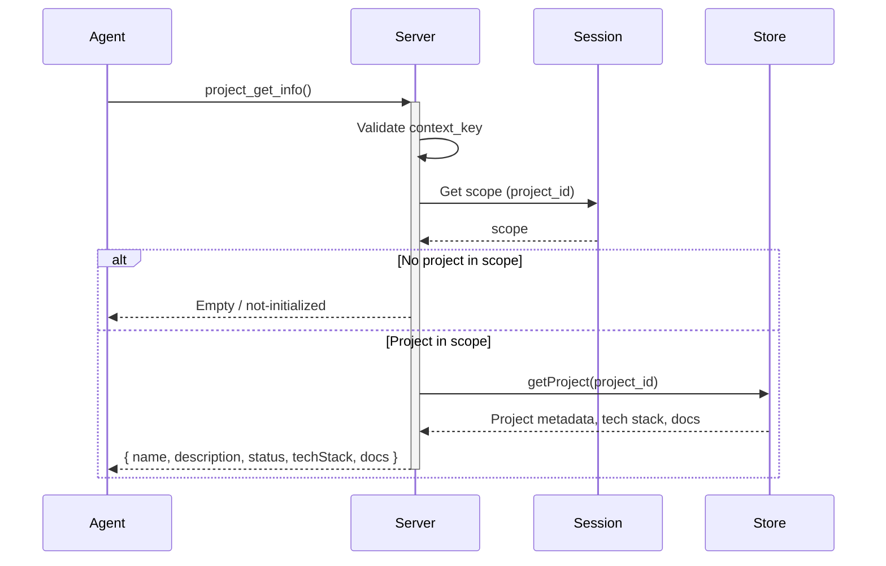
```mermaid
sequenceDiagram
  participant Agent
  participant Server
  participant Session
  participant Store

  Agent->>+Server: project_get_info()
  Server->>Server: Validate context_key
  Server->>Session: Get scope (project_id)
  Session-->>Server: scope
  alt No project in scope
    Server-->>Agent: Empty / not-initialized
  else Project in scope
    Server->>Store: getProject(project_id)
    Store-->>Server: Project metadata, tech stack, docs
    Server-->>-Agent: { name, description, status, techStack, docs }
  end
```

---

### project_update

**Activity diagram**

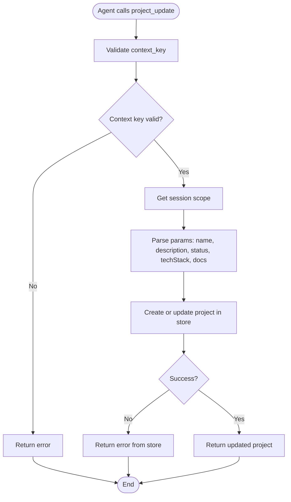
```mermaid
flowchart TB
  Start([Agent calls project_update]) --> ValidateContext[Validate context_key]
  ValidateContext --> ContextOk{Context key valid?}
  ContextOk -->|No| ErrContext[Return error]
  ContextOk -->|Yes| GetScope[Get session scope]
  GetScope --> Parse[Parse params: name, description, status, techStack, docs]
  Parse --> Upsert[Create or update project in store]
  Upsert --> Ok{Success?}
  Ok -->|No| ErrStore[Return error from store]
  Ok -->|Yes| Return[Return updated project]
  Return --> End([End])
  ErrContext --> End
  ErrStore --> End
```

**Sequence diagram**

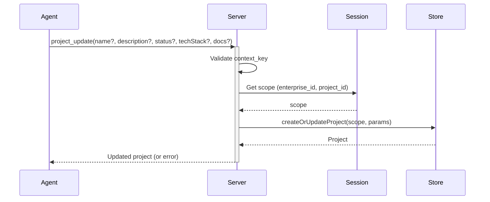
```mermaid
sequenceDiagram
  participant Agent
  participant Server
  participant Session
  participant Store

  Agent->>+Server: project_update(name?, description?, status?, techStack?, docs?)
  Server->>Server: Validate context_key
  Server->>Session: Get scope (enterprise_id, project_id)
  Session-->>Server: scope
  Server->>Store: createOrUpdateProject(scope, params)
  Store-->>Server: Project
  Server-->>-Agent: Updated project (or error)
```

---

## Tasks

### task_create

**Activity diagram**

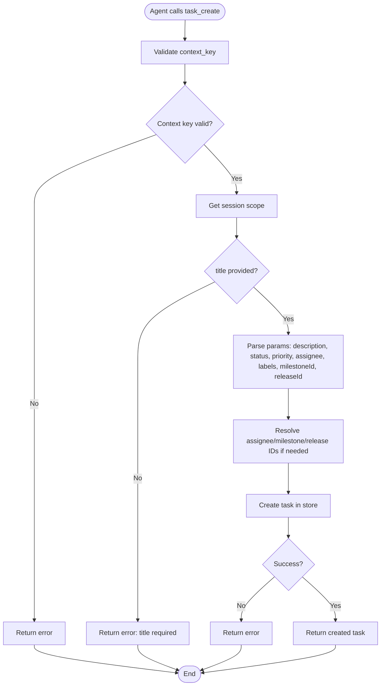
```mermaid
flowchart TB
  Start([Agent calls task_create]) --> ValidateContext[Validate context_key]
  ValidateContext --> ContextOk{Context key valid?}
  ContextOk -->|No| ErrContext[Return error]
  ContextOk -->|Yes| GetScope[Get session scope]
  GetScope --> HasTitle{title provided?}
  HasTitle -->|No| ErrTitle[Return error: title required]
  HasTitle -->|Yes| Parse[Parse params: description, status, priority, assignee, labels, milestoneId, releaseId]
  Parse --> ResolveRefs[Resolve assignee/milestone/release IDs if needed]
  ResolveRefs --> Create[Create task in store]
  Create --> Ok{Success?}
  Ok -->|No| ErrStore[Return error]
  Ok -->|Yes| Return[Return created task]
  Return --> End([End])
  ErrContext --> End
  ErrTitle --> End
  ErrStore --> End
```

**Sequence diagram**

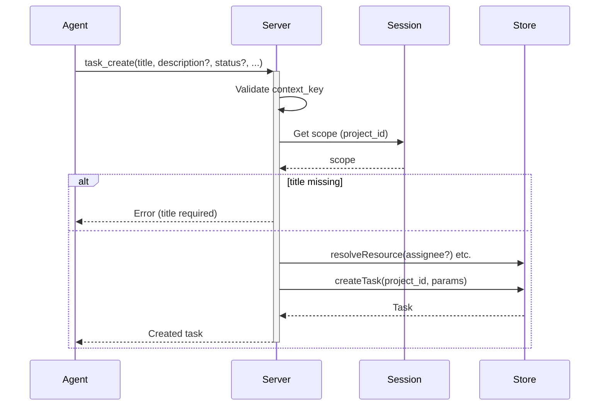
```mermaid
sequenceDiagram
  participant Agent
  participant Server
  participant Session
  participant Store

  Agent->>+Server: task_create(title, description?, status?, ...)
  Server->>Server: Validate context_key
  Server->>Session: Get scope (project_id)
  Session-->>Server: scope
  alt title missing
    Server-->>Agent: Error (title required)
  else
    Server->>Store: resolveResource(assignee?) etc.
    Server->>Store: createTask(project_id, params)
    Store-->>Server: Task
    Server-->>-Agent: Created task
  end
```

---

### task_update

**Activity diagram**

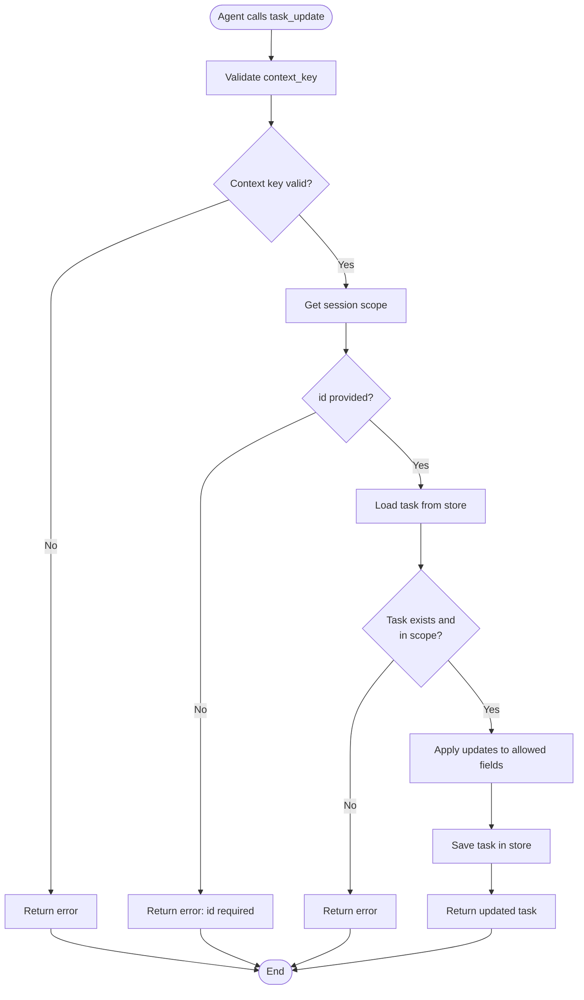
```mermaid
flowchart TB
  Start([Agent calls task_update]) --> ValidateContext[Validate context_key]
  ValidateContext --> ContextOk{Context key valid?}
  ContextOk -->|No| ErrContext[Return error]
  ContextOk -->|Yes| GetScope[Get session scope]
  GetScope --> HasId{id provided?}
  HasId -->|No| ErrId[Return error: id required]
  HasId -->|Yes| Load[Load task from store]
  Load --> Found{Task exists and\nin scope?}
  Found -->|No| ErrNotFound[Return error]
  Found -->|Yes| Apply[Apply updates to allowed fields]
  Apply --> Save[Save task in store]
  Save --> Return[Return updated task]
  Return --> End([End])
  ErrContext --> End
  ErrId --> End
  ErrNotFound --> End
```

**Sequence diagram**

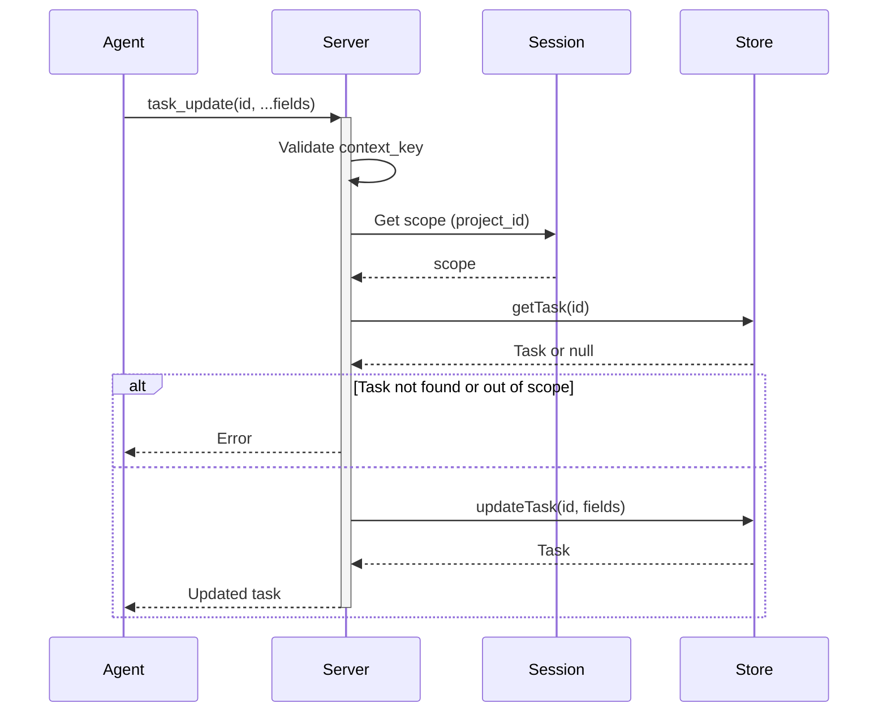
```mermaid
sequenceDiagram
  participant Agent
  participant Server
  participant Session
  participant Store

  Agent->>+Server: task_update(id, ...fields)
  Server->>Server: Validate context_key
  Server->>Session: Get scope (project_id)
  Session-->>Server: scope
  Server->>Store: getTask(id)
  Store-->>Server: Task or null
  alt Task not found or out of scope
    Server-->>Agent: Error
  else
    Server->>Store: updateTask(id, fields)
    Store-->>Server: Task
    Server-->>-Agent: Updated task
  end
```

---

### task_list

**Activity diagram**

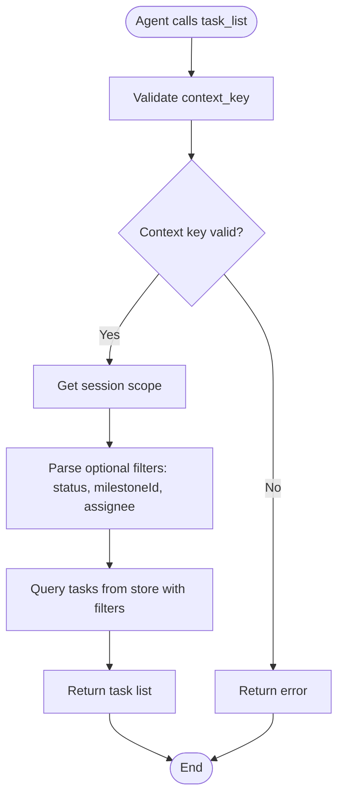
```mermaid
flowchart TB
  Start([Agent calls task_list]) --> ValidateContext[Validate context_key]
  ValidateContext --> ContextOk{Context key valid?}
  ContextOk -->|No| ErrContext[Return error]
  ContextOk -->|Yes| GetScope[Get session scope]
  GetScope --> ParseFilters[Parse optional filters: status, milestoneId, assignee]
  ParseFilters --> Query[Query tasks from store with filters]
  Query --> Return[Return task list]
  Return --> End([End])
  ErrContext --> End
```

**Sequence diagram**

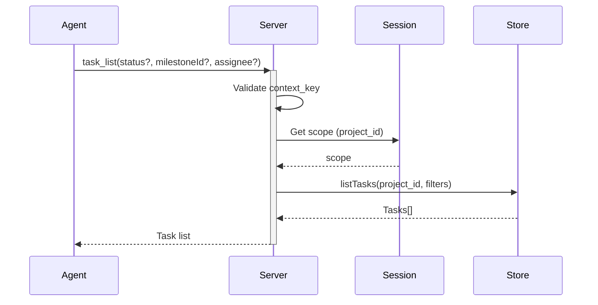
```mermaid
sequenceDiagram
  participant Agent
  participant Server
  participant Session
  participant Store

  Agent->>+Server: task_list(status?, milestoneId?, assignee?)
  Server->>Server: Validate context_key
  Server->>Session: Get scope (project_id)
  Session-->>Server: scope
  Server->>Store: listTasks(project_id, filters)
  Store-->>Server: Tasks[]
  Server-->>-Agent: Task list
```

---

### task_delete

**Activity diagram**

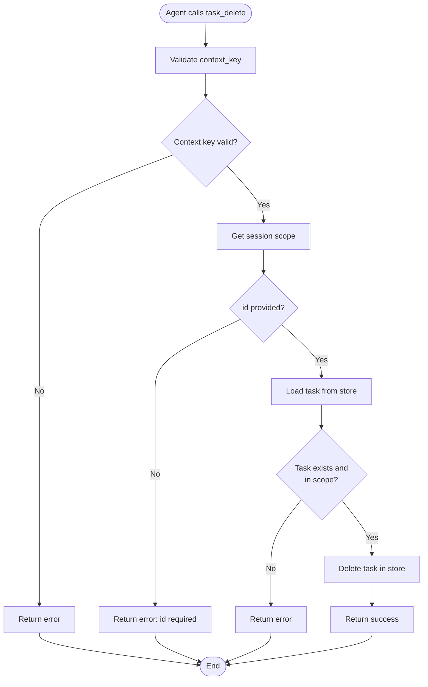
```mermaid
flowchart TB
  Start([Agent calls task_delete]) --> ValidateContext[Validate context_key]
  ValidateContext --> ContextOk{Context key valid?}
  ContextOk -->|No| ErrContext[Return error]
  ContextOk -->|Yes| GetScope[Get session scope]
  GetScope --> HasId{id provided?}
  HasId -->|No| ErrId[Return error: id required]
  HasId -->|Yes| Load[Load task from store]
  Load --> Found{Task exists and\nin scope?}
  Found -->|No| ErrNotFound[Return error]
  Found -->|Yes| Delete[Delete task in store]
  Delete --> Return[Return success]
  Return --> End([End])
  ErrContext --> End
  ErrId --> End
  ErrNotFound --> End
```

**Sequence diagram**

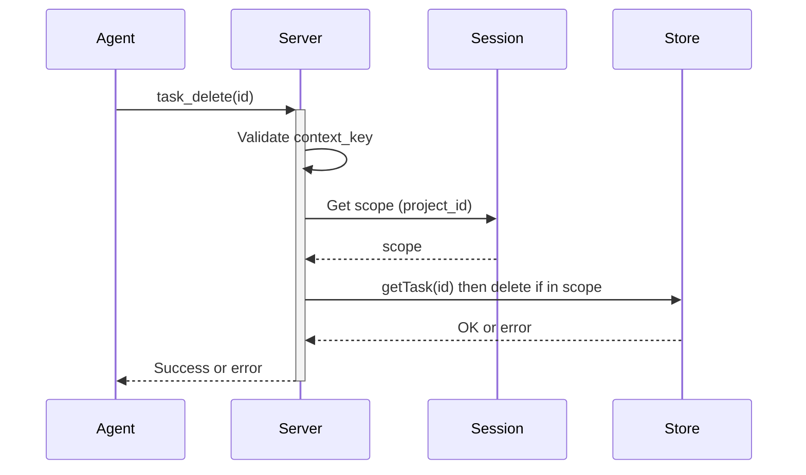
```mermaid
sequenceDiagram
  participant Agent
  participant Server
  participant Session
  participant Store

  Agent->>+Server: task_delete(id)
  Server->>Server: Validate context_key
  Server->>Session: Get scope (project_id)
  Session-->>Server: scope
  Server->>Store: getTask(id) then delete if in scope
  Store-->>Server: OK or error
  Server-->>-Agent: Success or error
```

---

## Planning

### milestone_create / milestone_update / milestone_list

**Activity diagram (milestone_create)**

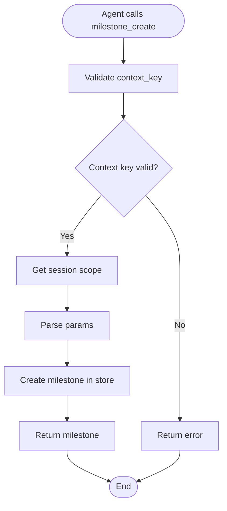
```mermaid
flowchart TB
  Start([Agent calls milestone_create]) --> ValidateContext[Validate context_key]
  ValidateContext --> ContextOk{Context key valid?}
  ContextOk -->|No| ErrContext[Return error]
  ContextOk -->|Yes| GetScope[Get session scope]
  GetScope --> Parse[Parse params]
  Parse --> Create[Create milestone in store]
  Create --> Return[Return milestone]
  Return --> End([End])
  ErrContext --> End
```

**Activity diagram (milestone_update)**

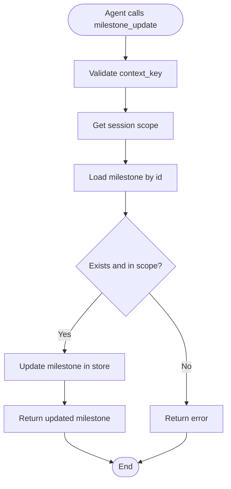
```mermaid
flowchart TB
  Start([Agent calls milestone_update]) --> ValidateContext[Validate context_key]
  ValidateContext --> GetScope[Get session scope]
  GetScope --> Load[Load milestone by id]
  Load --> Found{Exists and in scope?}
  Found -->|No| Err[Return error]
  Found -->|Yes| Update[Update milestone in store]
  Update --> Return[Return updated milestone]
  Return --> End([End])
  Err --> End
```

**Activity diagram (milestone_list)**

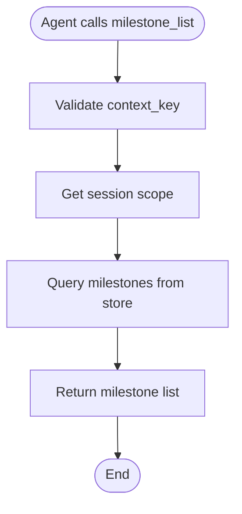
```mermaid
flowchart TB
  Start([Agent calls milestone_list]) --> ValidateContext[Validate context_key]
  ValidateContext --> GetScope[Get session scope]
  GetScope --> Query[Query milestones from store]
  Query --> Return[Return milestone list]
  Return --> End([End])
```

**Sequence diagram (milestone_* — create/update/list)**

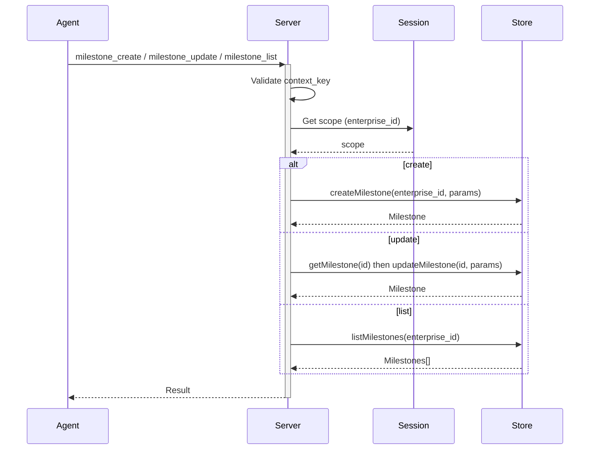
```mermaid
sequenceDiagram
  participant Agent
  participant Server
  participant Session
  participant Store

  Agent->>+Server: milestone_create / milestone_update / milestone_list
  Server->>Server: Validate context_key
  Server->>Session: Get scope (enterprise_id)
  Session-->>Server: scope
  alt create
    Server->>Store: createMilestone(enterprise_id, params)
    Store-->>Server: Milestone
  else update
    Server->>Store: getMilestone(id) then updateMilestone(id, params)
    Store-->>Server: Milestone
  else list
    Server->>Store: listMilestones(enterprise_id)
    Store-->>Server: Milestones[]
  end
  Server-->>-Agent: Result
```

---

### release_create / release_update / release_list

**Activity diagram (release_create)**

```mermaid
flowchart TB
  Start([Agent calls release_create]) --> ValidateContext[Validate context_key]
  ValidateContext --> GetScope[Get session scope]
  GetScope --> Parse[Parse params]
  Parse --> Create[Create release in store]
  Create --> Return[Return release]
  Return --> End([End])
```

**Activity diagram (release_update)**

```mermaid
flowchart TB
  Start([Agent calls release_update]) --> ValidateContext[Validate context_key]
  ValidateContext --> GetScope[Get session scope]
  GetScope --> Load[Load release by id]
  Load --> Found{Exists and in scope?}
  Found -->|No| Err[Return error]
  Found -->|Yes| Update[Update release in store]
  Update --> Return[Return updated release]
  Return --> End([End])
  Err --> End
```

**Activity diagram (release_list)**

```mermaid
flowchart TB
  Start([Agent calls release_list]) --> ValidateContext[Validate context_key]
  ValidateContext --> GetScope[Get session scope]
  GetScope --> Query[Query releases from store]
  Query --> Return[Return release list]
  Return --> End([End])
```

**Sequence diagram (release_* — create/update/list)**

```mermaid
sequenceDiagram
  participant Agent
  participant Server
  participant Session
  participant Store

  Agent->>+Server: release_create / release_update / release_list
  Server->>Server: Validate context_key
  Server->>Session: Get scope (project_id)
  Session-->>Server: scope
  alt create
    Server->>Store: createRelease(project_id, params)
    Store-->>Server: Release
  else update
    Server->>Store: getRelease(id) then updateRelease(id, params)
    Store-->>Server: Release
  else list
    Server->>Store: listReleases(project_id)
    Store-->>Server: Releases[]
  end
  Server-->>-Agent: Result
```

---

## Docs

### doc_register

**Activity diagram**

```mermaid
flowchart TB
  Start([Agent calls doc_register]) --> ValidateContext[Validate context_key]
  ValidateContext --> GetScope[Get session scope]
  GetScope --> Parse[Parse name, path, type, description?]
  Parse --> Upsert[Add or update doc entry in project]
  Upsert --> Return[Return doc entry]
  Return --> End([End])
```

**Sequence diagram**

```mermaid
sequenceDiagram
  participant Agent
  participant Server
  participant Session
  participant Store

  Agent->>+Server: doc_register(name, path, type, description?)
  Server->>Server: Validate context_key
  Server->>Session: Get scope (project_id)
  Session-->>Server: scope
  Server->>Store: registerDoc(project_id, name, path, type, description?)
  Store-->>Server: Doc entry
  Server-->>-Agent: Doc entry
```

---

### doc_list

**Activity diagram**

```mermaid
flowchart TB
  Start([Agent calls doc_list]) --> ValidateContext[Validate context_key]
  ValidateContext --> GetScope[Get session scope]
  GetScope --> Load[Load doc list from project]
  Load --> Return[Return doc list]
  Return --> End([End])
```

**Sequence diagram**

```mermaid
sequenceDiagram
  participant Agent
  participant Server
  participant Session
  participant Store

  Agent->>+Server: doc_list()
  Server->>Server: Validate context_key
  Server->>Session: Get scope (project_id)
  Session-->>Server: scope
  Server->>Store: listDocs(project_id)
  Store-->>Server: Docs[]
  Server-->>-Agent: Doc list
```

---

### doc_read

**Activity diagram**

```mermaid
flowchart TB
  Start([Agent calls doc_read]) --> ValidateContext[Validate context_key]
  ValidateContext --> GetScope[Get session scope]
  GetScope --> ResolvePath[Resolve path relative to project root]
  ResolvePath --> Read[Read file from filesystem]
  Read --> Found{File exists and\nwithin project root?}
  Found -->|No| Err[Return error]
  Found -->|Yes| Return[Return file contents]
  Return --> End([End])
  Err --> End
```

**Sequence diagram**

```mermaid
sequenceDiagram
  participant Agent
  participant Server
  participant Session
  participant FS as File system

  Agent->>+Server: doc_read(path)
  Server->>Server: Validate context_key
  Server->>Session: Get scope (project_id) and project root
  Session-->>Server: scope, project_root
  Server->>Server: Resolve path (relative to project root)
  Server->>FS: Read file(path)
  FS-->>Server: Content or error
  alt File not found or outside root
    Server-->>Agent: Error
  else
    Server-->>-Agent: File contents
  end
```

---

## Resources

Resources are read-only. The server validates the context key and scope, then returns the current project state. No mutation.

### project://current/spec

**Activity diagram**

```mermaid
flowchart TB
  Start([Agent requests resource]) --> ValidateContext[Validate context_key]
  ValidateContext --> ContextOk{Context key valid?}
  ContextOk -->|No| ErrContext[Return error]
  ContextOk -->|Yes| GetScope[Get session scope]
  GetScope --> HasProject{Project in scope?}
  HasProject -->|No| ReturnEmpty[Return empty or error]
  HasProject -->|Yes| Load[Load project metadata, tech stack, doc list from store]
  Load --> Build[Build resource content]
  Build --> Return[Return spec to agent]
  Return --> End([End])
  ErrContext --> End
  ReturnEmpty --> End
```

**Sequence diagram**

```mermaid
sequenceDiagram
  participant Agent
  participant Server
  participant Session
  participant Store

  Agent->>+Server: Read resource project://current/spec
  Note over Agent,Server: context_key in request
  Server->>Server: Validate context_key
  Server->>Session: Get scope (project_id)
  Session-->>Server: scope
  Server->>Store: getProject(project_id)
  Store-->>Server: Project (metadata, tech stack, docs)
  Server-->>-Agent: Resource content (spec)
```

---

### project://current/tasks

**Activity diagram**

```mermaid
flowchart TB
  Start([Agent requests resource]) --> ValidateContext[Validate context_key]
  ValidateContext --> GetScope[Get session scope]
  GetScope --> HasProject{Project in scope?}
  HasProject -->|No| ReturnEmpty[Return empty or error]
  HasProject -->|Yes| Load[Load full task list from store]
  Load --> Build[Build resource content]
  Build --> Return[Return tasks to agent]
  Return --> End([End])
  ReturnEmpty --> End
```

**Sequence diagram**

```mermaid
sequenceDiagram
  participant Agent
  participant Server
  participant Session
  participant Store

  Agent->>+Server: Read resource project://current/tasks
  Server->>Server: Validate context_key
  Server->>Session: Get scope (project_id)
  Session-->>Server: scope
  Server->>Store: listTasks(project_id)
  Store-->>Server: Tasks[]
  Server-->>-Agent: Resource content (full task list)
```

---

### project://current/plan

**Activity diagram**

```mermaid
flowchart TB
  Start([Agent requests resource]) --> ValidateContext[Validate context_key]
  ValidateContext --> GetScope[Get session scope]
  GetScope --> HasProject{Project in scope?}
  HasProject -->|No| ReturnEmpty[Return empty or error]
  HasProject -->|Yes| Load[Load milestones and releases from store]
  Load --> Build[Build resource content]
  Build --> Return[Return plan to agent]
  Return --> End([End])
  ReturnEmpty --> End
```

**Sequence diagram**

```mermaid
sequenceDiagram
  participant Agent
  participant Server
  participant Session
  participant Store

  Agent->>+Server: Read resource project://current/plan
  Server->>Server: Validate context_key
  Server->>Session: Get scope (enterprise_id, project_id)
  Session-->>Server: scope
  Server->>Store: listMilestones(enterprise_id), listReleases(project_id)
  Store-->>Server: Milestones[], Releases[]
  Server-->>-Agent: Resource content (milestones, releases)
```
