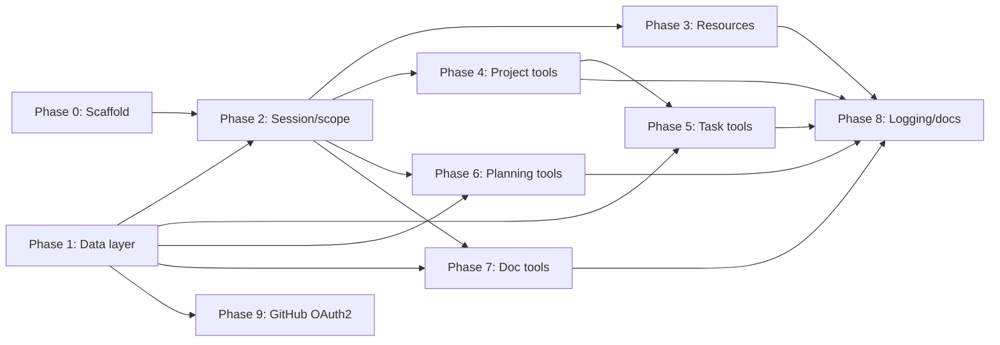

# Implementation Plan

This document provides a **detailed implementation plan** for the Software Project Management MCP server. It aligns with [05 — Tech and Implementation](05-tech-and-implementation.html), [04 — MCP Surface](04-mcp-surface.html), [03 — Data Model](03-data-model.html), and [06 — Tech Requirements](06-tech-requirements.html).

---

## Overview

| Phase | Name | Goal | Est. effort |
|-------|------|------|-------------|
| 0 | Setup and scaffold | Solution, MCP server shell, one tool | 1–2 days |
| 1 | Data layer | PostgreSQL schema, migrations, data access | 3–5 days |
| 2 | Session and scope | Context key, scope_set/scope_get, session store | 2–3 days |
| 3 | Resources | project://current/spec, /tasks, /plan | 2 days |
| 4 | Project tools | project_get_info, project_update | 1–2 days |
| 5 | Task tools | task_create, task_update, task_list, task_delete | 2–3 days |
| 6 | Planning tools | milestone_*, release_* | 2–3 days |
| 7 | Doc tools | doc_register, doc_list, doc_read | 1–2 days |
| 8 | Logging and hardening | Serilog, path safety, validation, docs | 2–3 days |
| 9 | GitHub OAuth2 integration | OAuth App, ASP.NET Core auth, claims, resource/scope resolution | 2–3 days |

Total rough estimate: **18–28 days** (single developer, excluding deployment automation). Phase 9 is required for the [Project Web App](14-project-web-app.html) and [Mobile App](15-mobile-app.html).

---

## Phase 0: Setup and scaffold

**Goal:** Run a minimal MCP server that exposes one tool and responds over stdio.

### Tasks

| ID | Task | Details | Dependencies |
|----|------|---------|--------------|
| 0.1 | Create solution and projects | Solution with: (1) MCP server console app (.NET 8), (2) App Host (Aspire) project, (3) optional test project. Use `dotnet new`; SDK-style csproj. | — |
| 0.2 | Add MCP .NET SDK | Add NuGet package for official MCP .NET server (e.g. `ModelContextProtocol` or current SDK name). Target stdio transport. | 0.1 |
| 0.3 | Register one tool | Implement a single tool (e.g. `project_get_info`) that returns a stub or empty result. Register with the MCP server. | 0.2 |
| 0.4 | Wire stdio and Initialize | Ensure server reads/writes stdio per MCP spec. Handle Initialize request and return capabilities, tool list. No context_key yet. | 0.2 |
| 0.5 | Verify from Cursor | Document how to add the server to Cursor (e.g. command, args). Manually verify: server starts, tool appears, call returns. | 0.3, 0.4 |

### Deliverables

- Solution builds with `dotnet build`.
- `dotnet run --project <ServerProject>` starts the server; Cursor can list and call the stub tool.
- README section: "Running the server locally" and "Adding to Cursor."

### Acceptance criteria

- [ ] One tool visible in Cursor and callable.
- [ ] Tool response is valid JSON (e.g. empty project or stub).
- [ ] No database or config file required for this phase.

---

## Phase 1: Data layer

**Goal:** PostgreSQL schema, migrations, and data access for project, tasks, milestones, releases (v1 scope). No MCP tools yet beyond stub.

### Tasks

| ID | Task | Details | Dependencies |
|----|------|---------|--------------|
| 1.1 | Define entity models | C# types for Enterprise, Project, Task, Milestone, Release, Doc (per [03 — Data Model](03-data-model.html)). Include id (GUID), display_id/slug, FKs. Use nullable reference types. | — |
| 1.2 | Choose data access | Select EF Core + Npgsql or Dapper + Npgsql. Add packages and DbContext or repository interfaces. | 1.1 |
| 1.3 | Create initial migration | Tables: enterprise, project, task, milestone, release, docs (or project-embedded docs). Match doc section "PostgreSQL persistence" in [03 — Data Model](03-data-model.html). Use UTF-8; JSONB for tech_stack, labels where specified. | 1.2 |
| 1.4 | Connection from env | Read connection string from env (e.g. `DATABASE_URL`, `PROJECT_MCP_CONNECTION_STRING`, or `ConnectionStrings__DefaultConnection`). Validate on startup; fail fast with clear message if missing. | 1.2 |
| 1.5 | Implement project CRUD | Methods: GetProject(projectId), CreateOrUpdateProject(enterpriseId, projectId?, dto). Scope to single enterprise/project for v1 if needed. | 1.3, 1.4 |
| 1.6 | Implement task repository | CreateTask, UpdateTask, GetTask, ListTasks(filters), DeleteTask. Filters: status, milestoneId, assignee. | 1.3, 1.4 |
| 1.7 | Implement milestone/release repositories | Create/Update/List for milestones (by enterprise) and releases (by project). | 1.3, 1.4 |
| 1.8 | Implement docs storage | Register doc (name, path, type, description); list docs by project. Store in docs table or JSONB on project. | 1.3, 1.4 |
| 1.9 | Implement change tracking | Enable change tracking on all fields of all entity tables per [03 — Data Model](03-data-model.html). Add audit/history tables or triggers that record insert/update/delete for every entity table and every column; capture old/new value (or row state), changed_at, **session identifier** (e.g. context_key or session id), **resource identifier** (resource_id of the actor), and **correlation id** of the request (when provided). Ensure no entity or field is excluded. | 1.3 |

### Deliverables

- Migrations apply cleanly to a fresh Postgres database.
- Repository or DbContext can load/save project, tasks, milestones, releases, docs.
- No secrets in code; connection string from env only.

### Acceptance criteria

- [ ] `dotnet ef database update` (or equivalent) creates schema.
- [ ] Unit or integration tests can create a project and task and read them back.
- [ ] Schema matches documented tables (id, display_id, FKs, JSONB where specified).
- [ ] Change tracking is enabled on all fields of all entity tables (audit/history recorded on insert/update/delete).

---

## Phase 2: Session and scope

**Goal:** Context key at handshake; session store; scope_set and scope_get; all subsequent tools/resources use session scope.

### Tasks

| ID | Task | Details | Dependencies |
|----|------|---------|--------------|
| 2.1 | Session store | In-memory session store (connection/session id → scope). Store enterprise_id, project_id per session. For stdio, one connection = one session; generate context_key (e.g. GUID) on Initialize. | Phase 0 |
| 2.2 | Issue context_key in Initialize | In Initialize response, include context_key. Document that the client must send it on every request (header or envelope per transport). | 2.1 |
| 2.3 | Validate context_key on each request | Middleware or handler: resolve context_key to session; if missing/invalid/expired, return error and do not run tool or resource. | 2.1, 2.2 |
| 2.4 | Implement scope_set | Parameters: enterprise_id?, project_id? (GUID or slug). At least one required. Resolve slugs to GUIDs; validate IDs exist. Store in session; return set scope. | 2.1, 1.5 |
| 2.5 | Implement scope_get | Return current session scope (enterprise_id, project_id). No parameters. | 2.1 |
| 2.6 | Default scope from config | If env PROJECT_MCP_ENTERPRISE_ID and/or PROJECT_MCP_PROJECT_ID are set, use as default when session has no scope yet. Otherwise require scope_set before other tools. | 2.1 |
| 2.7 | Wire scope into stub project_get_info | project_get_info uses session scope to call GetProject(project_id). Return empty/not-initialized if no project. | 2.3, 2.4, 1.5 |

### Deliverables

- context_key in Initialize response; validation on every request.
- scope_set and scope_get tools working; scope persisted per session.
- project_get_info (from Phase 0) now reads from DB using session scope.

### Acceptance criteria

- [ ] Request without valid context_key is rejected.
- [ ] After scope_set, project_get_info returns project for that scope (or empty).
- [ ] scope_get returns the same scope set by scope_set.

---

## Phase 3: Resources

**Goal:** Implement read-only resources so the client can load project state without calling tools.

### Tasks

| ID | Task | Details | Dependencies |
|----|------|---------|--------------|
| 3.1 | Register resource URIs | Expose in capabilities: project://current/spec, project://current/tasks, project://current/plan. | Phase 0 |
| 3.2 | Resolve "current" from session | When a resource is requested, resolve "current" from session scope (project_id, enterprise_id). | 2.3 |
| 3.3 | Implement project://current/spec | Load project metadata, tech stack, doc list from store; return as resource content (e.g. JSON or MCP resource format). | 1.5, 3.2 |
| 3.4 | Implement project://current/tasks | Load full task list for project from store; return as resource content. | 1.6, 3.2 |
| 3.5 | Implement project://current/plan | Load milestones (by enterprise) and releases (by project); return combined plan. | 1.7, 3.2 |

### Deliverables

- All three resources return correct data for the session scope.
- Context key required; invalid scope or no project returns empty or error per spec.

### Acceptance criteria

- [ ] Client can read project://current/spec, /tasks, /plan and receive scope-appropriate data.
- [ ] After scope_set, resource content reflects the set project/enterprise.

---

## Phase 4: Project tools

**Goal:** project_get_info (real implementation) and project_update.

### Tasks

| ID | Task | Details | Dependencies |
|----|------|---------|--------------|
| 4.1 | project_get_info | Return project metadata (name, description, status, tech stack, docs). Use session scope; return empty if no project. Already partially done in Phase 2; ensure full shape per [04 — MCP Surface](04-mcp-surface.html). | 2.7, 1.5 |
| 4.2 | project_update | Parameters: name, description, status, techStack, docs (array of { name, path, type, description? }). Create or update project in store; return updated project. Validate types and allowed values. | 1.5 |
| 4.3 | Input validation | Validate project_update inputs (e.g. status in allowed set). Return structured error { error: string } with isError: true on validation failure. | 4.2 |

### Deliverables

- project_get_info and project_update both work against PostgreSQL.
- Errors are consistent (e.g. JSON with error message and isError).

### Acceptance criteria

- [ ] project_update can create a project and set name, description, status, tech stack, docs.
- [ ] project_get_info returns the same data after project_update.

---

## Phase 5: Task tools

**Goal:** task_create, task_update, task_list, task_delete with filters.

### Tasks

| ID | Task | Details | Dependencies |
|----|------|---------|--------------|
| 5.1 | task_create | Parameters: title (required), description, status, priority, assignee, labels, milestoneId, releaseId. Resolve assignee/milestone/release if needed. Create task in store; return created task. | 1.6 |
| 5.2 | task_update | Parameters: id (required), optional fields to update. Load task; verify in scope; apply updates; save. Return updated task or error. | 1.6 |
| 5.3 | task_list | Parameters: optional filters (status, milestoneId, assignee). Query store; return list. | 1.6 |
| 5.4 | task_delete | Parameter: id (required). Load task; verify in scope; delete. Return success or error. | 1.6 |
| 5.5 | Validation and errors | Validate required fields (e.g. title on create, id on update/delete). Return structured errors. | 5.1–5.4 |

### Deliverables

- All four task tools implemented and wired to MCP.
- List supports optional filters; create/update/delete enforce scope.

### Acceptance criteria

- [ ] task_create with title creates a task; task_list returns it; task_update changes it; task_delete removes it.
- [ ] task_list with status/milestoneId/assignee filters returns correct subset.

---

## Phase 6: Planning tools

**Goal:** milestone_create, milestone_update, milestone_list; release_create, release_update, release_list.

### Tasks

| ID | Task | Details | Dependencies |
|----|------|---------|--------------|
| 6.1 | milestone_create / update / list | Implement all three; scope milestones by enterprise_id from session. Create/update validate and persist; list returns milestones for enterprise. | 1.7 |
| 6.2 | release_create / update / list | Implement all three; scope releases by project_id from session. | 1.7 |
| 6.3 | Consistent response shape | All return structured JSON; errors with same shape as other tools. | 6.1, 6.2 |

### Deliverables

- Six planning tools implemented and registered.
- Milestones keyed by enterprise; releases by project.

### Acceptance criteria

- [ ] Create milestone and release; list returns them; update changes them.
- [ ] Scope is enforced (e.g. list only returns data for session enterprise/project).

---

## Phase 7: Doc tools

**Goal:** doc_register, doc_list, doc_read (with path safety).

### Tasks

| ID | Task | Details | Dependencies |
|----|------|---------|--------------|
| 7.1 | doc_register | Add or update doc entry (name, path, type, description?). Persist to project's docs. | 1.8 |
| 7.2 | doc_list | List registered docs for current project. | 1.8 |
| 7.3 | doc_read | Read file by path (relative to project root). Resolve PROJECT_MCP_ROOT or cwd; resolve path relative to root; reject path traversal (.. or absolute outside root). Return file contents or error. | 1.8, [06 — Tech Requirements](06-tech-requirements.html) (path safety) |
| 7.4 | Path safety tests | Unit tests for path resolution: valid relative path, .. rejected, absolute outside root rejected. | 7.3 |

### Deliverables

- doc_register, doc_list, doc_read implemented.
- doc_read only reads under project root; no path escape.

### Acceptance criteria

- [ ] doc_register adds an entry; doc_list shows it.
- [ ] doc_read returns file content for a path under project root; returns error for ../etc/passwd or similar.

---

## Phase 8: Logging and hardening

**Goal:** Structured logging (Serilog), configurable sink, non-blocking; correlation_id in logs; path safety and input validation audit; README and config docs.

### Tasks

| ID | Task | Details | Dependencies |
|----|------|---------|--------------|
| 8.1 | Add Serilog | Add Serilog and async/buffered sink. **All log records must include when available:** session identification (e.g. context_key), resource identification (resource_id), and correlation id. Add tool name, scope, and other context as needed. **When logging exceptions,** add the name-value pairs from the exception’s **Data** property as structured properties on the log entry (e.g. via a Serilog enricher or exception destructurer). **For exceptions with inner exceptions,** produce another log entry for each inner exception **recursively** (one log entry per exception in the chain), each with its own Data and stack trace; reference the parent so the chain can be reconstructed. No secrets in logs. | — |
| 8.2 | Configurable logging sink | Logging target configurable via env or config (e.g. SERILOG__WRITE_TO or sink URL). Default to console in dev. | 8.1 |
| 8.3 | Non-blocking log writes | Use Serilog async sink or in-process queue so request path does not wait on logging provider. | 8.1 |
| 8.4 | Correlation ID | Accept correlation_id on requests (header or envelope); add to log properties. Do not validate value. | 8.1 |
| 8.5 | Input validation audit | Review all tools: required fields, types, allowed enums. Ensure invalid input returns clear error, not exception. | All tool phases |
| 8.6 | Enterprise scope on every endpoint | Ensure every MCP tool and resource validates that requested or submitted data is within the session’s enterprise (and project). Reject cross-enterprise access with an error; **log** each attempt with context_key, tool/resource, requested ids, target enterprise for **manual follow-up**. See [06 — Tech Requirements](06-tech-requirements.html). | All tool phases |
| 8.7 | README and env docs | README: how to run, add to Cursor, env vars (DATABASE_URL, PROJECT_MCP_ROOT, PROJECT_MCP_ENTERPRISE_ID, PROJECT_MCP_PROJECT_ID), database setup, migrations. | All phases |
| 8.8 | Schema/migration docs | Document how to run migrations; optionally add example seed data or script. | 1.3 |

### Deliverables

- Serilog in place; configurable sink; non-blocking; all log records include session identification, resource identification, and correlation id when available.
- All tools validate input and return structured errors.
- README and env/schema documentation complete.

### Acceptance criteria

- [ ] Logs include session identification, resource identification, and correlation id when available.
- [ ] Logged exceptions include exception.Data name-value pairs as structured properties; inner exceptions produce separate log entries recursively.
- [ ] Invalid tool input returns { error: string }, not a crash.
- [ ] New developer can follow README to set up DB, run server, and use in Cursor.

---

## Phase 9: GitHub OAuth2 integration

**Goal:** Set up GitHub as the OAuth2 provider so the web app (and API used by the mobile app) can authenticate users, resolve them to a resource via `oauth2_sub`, and enforce claims-based scope and the SUDO role. See [14 — Project Web App](14-project-web-app.html) and [15 — Mobile App](15-mobile-app.html).

### Tasks

| ID | Task | Details | Dependencies |
|----|------|---------|--------------|
| 9.1 | Create GitHub OAuth App | Register a GitHub OAuth App (see Instructions below). Obtain Client ID and Client Secret; configure callback URL and scopes. | — |
| 9.2 | Add auth packages and middleware | Add ASP.NET Core authentication (e.g. `Microsoft.AspNetCore.Authentication.OAuth` or `AspNetCore.Authentication.Github`). Configure `AddAuthentication`, `AddCookie`, and GitHub as external provider with ClientId, ClientSecret, CallbackPath, Scopes. | 9.1 |
| 9.3 | Implement callback and claim mapping | On callback, exchange code for access token; optionally call GitHub API `/user` to get user id and login. Map GitHub user id to `oauth2_sub` and build `ClaimsPrincipal` with name, role (e.g. SUDO from app config or DB), and app-defined enterprise/project scope. | 9.2, data layer for resources/scope |
| 9.4 | Protect API and web routes | Require authentication on API endpoints and Blazor pages; inject `HttpContext.User` or scope service. Reject unauthenticated requests with 401. | 9.3 |
| 9.5 | Enforce SUDO for enterprise create | On any “create enterprise” endpoint, check that the user has the SUDO role (from claims); if not, return 403 Forbidden. | 9.3 |
| 9.6 | Document configuration | Document env vars (e.g. `GitHub:ClientId`, `GitHub:ClientSecret`, `GitHub:CallbackPath`) and optional SUDO allow-list (e.g. GitHub user ids or logins that get SUDO). No secrets in repo. | 9.1 |

### Deliverables

- GitHub OAuth App registered and configured.
- Web app (or API host) redirects to GitHub for sign-in and handles callback; user gets a session with claims (GitHub user id, optional SUDO, enterprise/project scope).
- API and web routes require auth; enterprise creation requires SUDO.
- Configuration documented; secrets from env or secret store.

### Acceptance criteria

- [ ] Unauthenticated request to a protected endpoint returns 401.
- [ ] User can sign in via GitHub and is redirected back with a session.
- [ ] Claims include GitHub user id (for `oauth2_sub` / resource resolution) and app-defined scope (or placeholder); SUDO user can create enterprise, non-SUDO cannot.

### Instructions for GitHub OAuth2 integration

Follow these steps to integrate GitHub as the OAuth2 provider.

#### 1. Create a GitHub OAuth App

1. **Go to GitHub:** Log in to GitHub and open **Settings** → **Developer settings** → **OAuth Apps** (or go to [https://github.com/settings/developers](https://github.com/settings/developers)).
2. **New OAuth App:** Click **“New OAuth App”** (or “Register a new application”).
3. **Application name:** Choose a name (e.g. “ProjectMcp Web” or your org name).
4. **Homepage URL:** The public URL of your app (e.g. `https://your-app.example.com` or for local dev `http://localhost:5000`).
5. **Authorization callback URL:** Must match exactly what your app will use. Examples:
   - Local: `http://localhost:5000/signin-github` (if using the default path for the GitHub authentication scheme).
   - Production: `https://your-app.example.com/signin-github`.
   - For Blazor Server or an API, use the same base URL and path your middleware expects (see step 3).
6. **Register application.** GitHub will show the **Client ID**. Generate a **Client Secret** and store it securely (you will put it in env or secret store, not in code).
7. **Scopes:** In the OAuth App settings you can leave default scopes, or request **read:user** and **user:email** so the app can call the GitHub API for the user’s id and profile. For login-only, the default scope may be enough; for resolving user id via `/user`, ensure you have at least `read:user`.

#### 2. Configure ASP.NET Core authentication

1. **Add packages** (if not already present):
   - `Microsoft.AspNetCore.Authentication.Cookies`
   - `Microsoft.AspNetCore.Authentication.OAuth` (or a NuGet that provides GitHub, e.g. `AspNetCore.Authentication.Github` for a pre-built handler).
   - Alternatively use the generic OAuth handler and set `AuthorizationEndpoint`, `TokenEndpoint`, and `UserInformationEndpoint` to GitHub’s URLs (see [GitHub OAuth docs](https://docs.github.com/en/apps/oauth-apps/building-oauth-apps)).

2. **In `Program.cs` (or startup):**
   - Call `builder.Services.AddAuthentication(options => { ... })` with default scheme (e.g. Cookie) and `DefaultSignInScheme`.
   - Add `AddCookie` for the cookie that holds the session after login.
   - Add the GitHub provider, for example:
     - **If using a GitHub-specific package:** `AddGitHub(options => { options.ClientId = ...; options.ClientSecret = ...; options.CallbackPath = "/signin-github"; options.Scope.Add("read:user"); })`.
     - **If using generic OAuth:** Configure `ClientId`, `ClientSecret`, `CallbackPath`, `AuthorizationEndpoint` = `"https://github.com/login/oauth/authorize"`, `TokenEndpoint` = `"https://github.com/login/oauth/access_token"`, `UserInformationEndpoint` = `"https://api.github.com/user"`, and a `ClaimActions` mapping for the user id (e.g. map `id` from the user JSON to `ClaimTypes.NameIdentifier` or a custom “sub” claim).
   - Read **ClientId** and **ClientSecret** from configuration (e.g. `builder.Configuration["GitHub:ClientId"]`) or environment variables (e.g. `GITHUB_CLIENT_ID`, `GITHUB_CLIENT_SECRET`). Do not hardcode them.

3. **Callback path:** Use the same path you registered in the GitHub OAuth App (e.g. `/signin-github`). After GitHub redirects back, the middleware will exchange the code for an access token and run the `OnCreatingTicket` or similar event where you can call the GitHub API and add custom claims.

#### 3. Add custom claims (GitHub user id, SUDO, scope)

1. **In the OAuth options**, use the **OnCreatingTicket** (or equivalent) event:
   - The handler will have received the access token and (if configured) the user payload from GitHub’s `/user` endpoint.
   - From the user payload, read the **id** (numeric GitHub user id) and optionally **login**. Add a claim for the subject, e.g. `ClaimTypes.NameIdentifier` or `"sub"` with value = GitHub user id (as string). This will be used to match the user to a resource’s `oauth2_sub` in the database.
   - **SUDO role:** If the user is in a configured SUDO list (e.g. from appsettings or env: list of GitHub user ids or logins), add a claim e.g. `ClaimTypes.Role` = `"SUDO"` or `"role"` = `"SUDO"`.
   - **Enterprise/project scope:** Optionally call your own service or DB to look up the user’s allowed enterprises and projects (e.g. by resolving the GitHub user id to a resource, then loading that resource’s scope from a mapping table). Add claims such as `allowed_enterprises` (array of GUIDs) and `allowed_projects` (array of GUIDs). If you defer scope to per-request lookup, you can skip adding scope claims here and resolve scope in a service when handling API calls.

2. **Persistence:** Store the claims in the cookie (or in a server-side session keyed by session id). The cookie must be protected (HTTPS in production, secure flags).

#### 4. Protect routes and APIs

1. **Use `[Authorize]`** on controllers or minimal API endpoints that require a logged-in user. Call `app.UseAuthentication()` and `app.UseAuthorization()` in the pipeline.
2. **Blazor:** For Blazor Server, the `HttpContext.User` is the same as the cookie principal. Use `AuthorizeView` or `[Authorize]` on pages as needed. For Blazor WebAssembly calling an API, send the cookie (same-origin) or send a Bearer token if you implement token issuance from the server.
3. **Enterprise create:** In the endpoint or service that creates an enterprise, check `User.IsInRole("SUDO")` (or your SUDO claim name). If false, return `403 Forbidden`. Do not create the enterprise.

#### 5. Environment and configuration

- **Development:** Set `GITHUB_CLIENT_ID` and `GITHUB_CLIENT_SECRET` (or `GitHub:ClientId`, `GitHub:ClientSecret`) in your environment or `appsettings.Development.json` (and ensure appsettings are not committed if they contain secrets). Use a callback URL like `http://localhost:5000/signin-github` in both the GitHub OAuth App and your app.
- **Production:** Store the client secret in a secret store or environment variable; never in the image or repo. Use HTTPS and the production callback URL in the GitHub OAuth App.
- **SUDO allow-list:** Configure which GitHub user ids or logins have the SUDO role (e.g. `SudoUsers: ["github-id-123", "another-login"]` or from the database). Document in README or deployment docs.

#### 6. Optional: Resource resolution

- When handling API requests, resolve the current user’s **resource** by querying the `resources` table for `oauth2_sub` = the GitHub user id (from `User.FindFirst(ClaimTypes.NameIdentifier)?.Value` or your “sub” claim). Use that resource for “assigned to me” and task queue filtering. If no resource is found, the user may still have scope claims but no personal assignments.

---

## Dependency graph (summary)

---

## Risk and mitigation

| Risk | Mitigation |
|------|------------|
| MCP SDK API changes | Pin SDK version; check release notes before upgrading. |
| Schema drift from data model | Keep [03 — Data Model](03-data-model.html) and migrations in sync; review in Phase 1 and 8. |
| Scope creep to full data model | Implement only project, task, milestone, release, docs for v1; defer requirements, work items, etc. |

---

## Out of scope for initial implementation

- HTTP/SSE transport for MCP (stdio only for v1).
- Multi-project/multi-enterprise in one MCP process (single scope per session is enough for v1).
- Authentication/authorization **for the MCP server** (trust host process per [06 — Tech Requirements](06-tech-requirements.html)). The **web app and API** use GitHub OAuth2 (Phase 9).
- GitHub as MCP backend adapter (PostgreSQL only for MCP; adapter interface can be added later).
